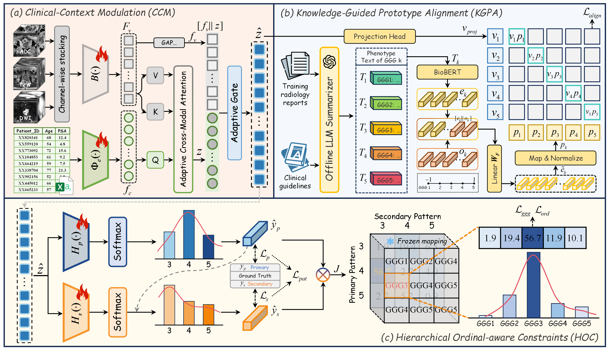

# KOAL: Knowledge-Driven Prostate Cancer Grading with Ordinal-Aware Learning

The code is currently being prepared and is not yet publicly available. We plan to release the complete implementation of KOAL in this repository within one week before or after MICCAI 2026. Thank you for your interest and patience.

